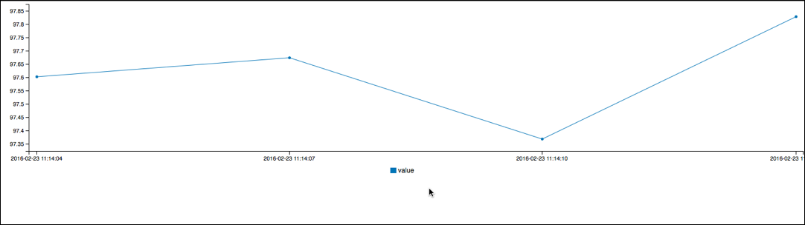
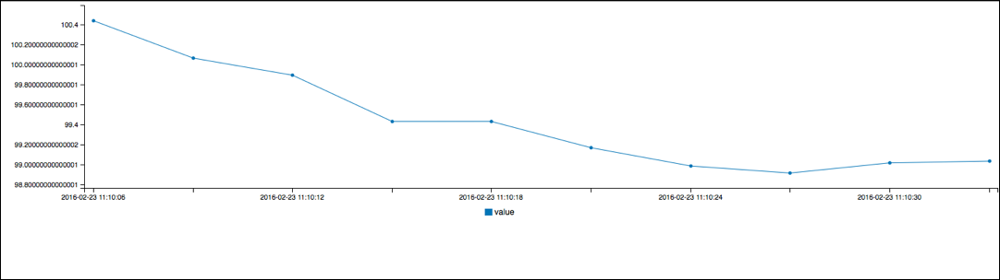
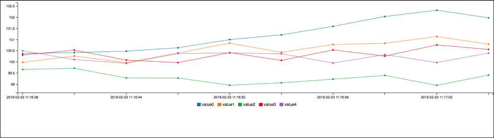
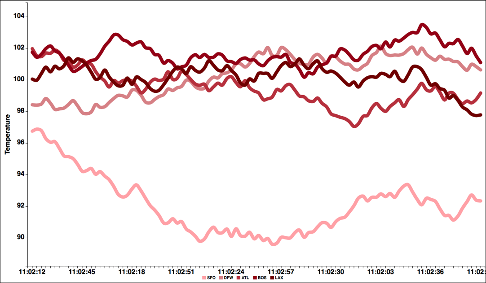

# Lesson 1: A Basic Chart

Let's start by building a simple line chart.  First, create a new HTML
file and add this to it.


``` html
<html>
<head>
<script type="text/javascript" src="//pubnub.github.io/eon/v/eon/0.0.9/eon.js"></script>
<link type="text/css" rel="stylesheet" href="//pubnub.github.io/eon/v/eon/0.0.9/eon.css" />
</head>
<body>
</body>
</html>
```

This is just an empty webpage that imports the EON Javascript and CSS.
Now create a div to hold the chart in the middle inside the `body`
element. Set the `id` to `chart`.

``` html
<div id="chart"></div>
```


Then create a new script section with this code

``` html
<script type="text/javascript">
var pubnub = PUBNUB.init({
    ssl           : true,  // <- enable TLS Tunneling over TCP
    subscribe_key : "sub-c-d784e128-da7d-11e5-9511-0619f8945a4f"
});
</script>
```

I've set up an existing PubNub channel which sends out a
randomly changing number every three seconds. You
can subscribe to it with the subscribe_key of `sub-c-d784e128-da7d-11e5-9511-0619f8945a4f`.

Now we can setup a simple chart like this:

``` javascript
//after the pubnub
eon.chart({
    channel: "random1",
    generate: {
        bindto: '#chart',
    },
    pubnub: pubnub
});
```

Refresh your browser and wait a couple of seconds. You should start to see points show up in
your chart.  Check the Javascript console of your browser if you are having any problems.




Great, We have a chart. But we can already notice a few problems.
The data shows up immediately but the chart looks empty. This is because
it doesn't have any data points from before you loaded the page. If you load the page again you'll
again lose the old data. To fix this lets use history.  Set the history option to true.

``` javascript
eon.chart({
    channel: "random1",
    generate: {
        bindto: '#chart',
    },
    history:true,
    pubnub: pubnub
});
```

Now when we reload the chart the previous data points are there.
It's that easy. If the stream is set up to support history (which this one is) then eon handles the rest.



Now lets try showing multiple datasets at once.  I've set up a second stream which generates three sets
of test data.  Just change the channel to `random5`.
Eon will automatically adapt to receiving 5 data points instead of 1.




# Make it Prettier

Now that we have a chart let's make it look a little prettier. An ugly chart is an uninformative chart. Imagine
this is a set of temperature data for airports around the country. It might be viewed by people in an airport
who want to see the temp at other cities they are going to. We need to make the chart look better
before putting it into an airport.

## Set the Limit
First, let's change the number of points we see at once. By default, an EON chart only shows the last 10 items.
Depending on your data that might be fine, but that is a poor fit for temperature data. We get one data point every three
seconds. At that rate we can only see the last half a minute.  Let's increase it to 100 so that we get the last
five minutes. Then we can start seeing trends.  

Changing the item count is easy. Set the 'limit' property to a higher number.

``` javascript
    history:true,
    pubnub: pubnub,    
    limit: 100,
```

## Style the Axes
Let's also fix up the X-axis. Notice that the chart already has ticks even though we didn't configure it.
By default EON will use the timestamp of each message for the labels.  We could make the chart
use a different attribute of each data point if the data wasn't in a time series,
but for our data it's fine. However, we do want to *reformat* the timestamps.
We don't need to know the full date, just the current time. We can reformat these labels by
defining a custom x axis.  We also want a label for the Y axis saying that this is temperature.  We can make
both of these changes by creating an `axis` parameter like this.

``` javascript
eon.chart({
    channel: "random5",
    generate: {
        bindto: '#chart',
        axis: {
            x: {
                type: 'timeseries',
                tick: {
                    format: '%H:%m:%S'
                }
            },
            y: {
                label: {
                    text: 'Temperature',
                    position: 'outer-middle'
                }
            },
        }
    },
    history:true,
    pubnub: pubnub,
    limit: 30,
});
```

In the code above the `x` axis is defined with a type of `timeseries` and
tick format of `%H:%m:%S`. This format will make timestamps with the hour, minute, and second
like this:  `12:48:51`.  The `y` axis is defined with the
label `Temperature` and a position value. The position of `outer-middle` will
move the label to be on the outside of the chart on the left, and vertically
centered.

There are many options for customizing the labels. Labels are rendered by the
C3 library so you can find
that in [the official C3 Docs](http://c3js.org/gettingstarted.html#customize)

## Filling the Screen
Now let's make the chart fill the screen and change the colors and fonts.  The entire chart is rendered into a
DIV, so we can make the DIV fill the screen with standard CSS:

Put this at the top of your page inside the HEAD element:

``` html
  <style type="text/css">
      html, body { margin: 0; }
      #chart {
          position: absolute;
          top:0;
          bottom:0;
          left:0;
          right:0;
      }
```

## Style the Data


Since this chart might be seen from far away on a TV, let's make the lines thicker. Any style
which is shared by multiple items can be set with CSS.  To make the lines thick and give
them nice round end caps, do:

```
    .c3 svg {
        font: bold 20px sans-serif;
    }
    .c3-chart-line path {
        stroke-width: 10px;
        stroke-linecap: round;
    }
</style>
```

Now we need to change the colors of each line itself. While we are at it, let's give
the values names other than value0, value1, etc.  

``` javascript
  data: {
      type:'spline',
      colors: {
          value0:'#ffaaaa',
          value1:'#cc8888',
          value2:'#aa4444',
          value3:'#882222',
          value4:'#660000'
      },
      names: {
          value0: "SFO",
          value1: "DFW",
          value2: "ATL",
          value3: "BOS",
          value4: "LAX"
      }
  },
```

The colors are hex values. The names are simply strings.  I also set the type to `spline` to make
the lines look smoother.

And finally lets hide the points

``` javascript
    //inside the 'generate' object
    point: {
        show: false
    },
```


Look at
[these examples](http://c3js.org/examples.html) for more information on customizing the chart


Now your final chart should look like this:




That's it for lesson 1.

You can see the full source for this example in [lesson1.html](https://github.com/pubnub/eon-workshop/blob/master/lesson1/lesson1.html) in Github.
