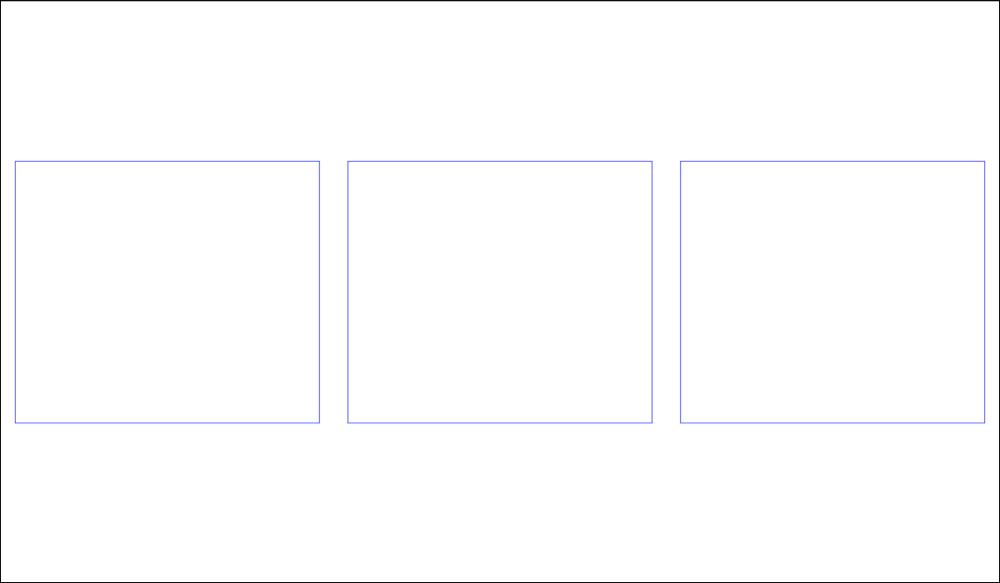
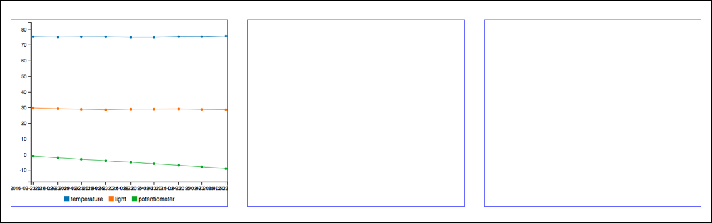
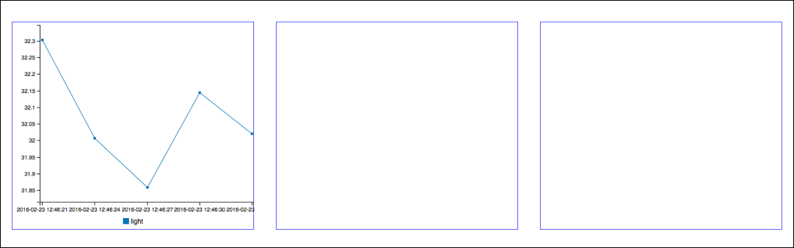
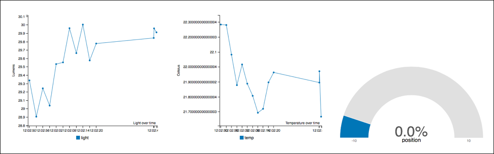
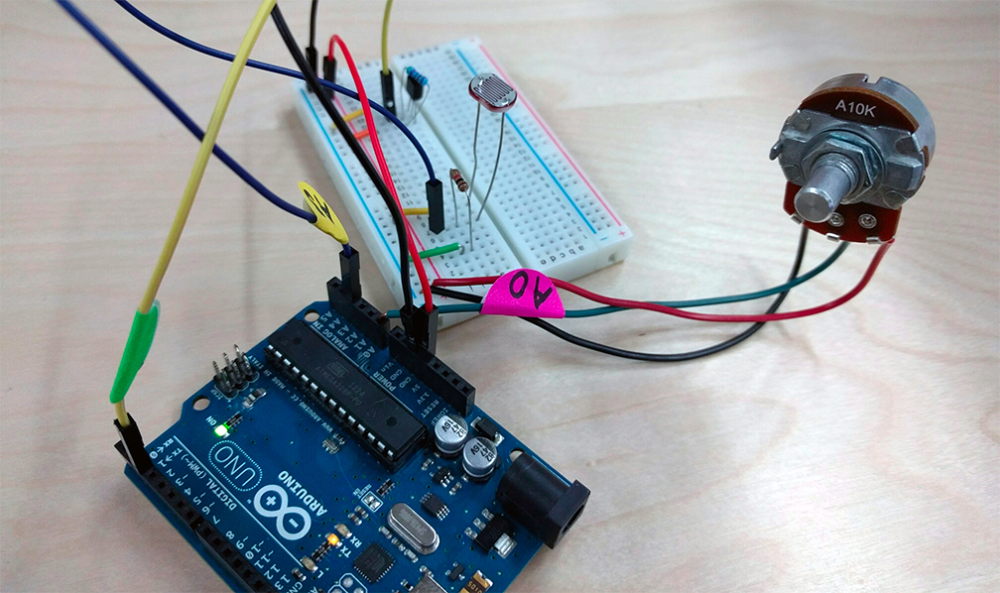

# Lesson 2: Charts for Sensors

In this lesson we will build a set of three charts that will connect to real world
sensors.  We have three sensors: a temperature sensor, a light sensor, and a potentiometer
(volume knob). We have created a stream which will give you fake sensor data.
After you complete the lesson you can switch to the real device up front.

Create a new HTML file with the same boiler plate as before, but with a few additions.

``` html
<!DOCTYPE html>
<html lang="en">
<head>
  <meta charset="UTF-8">
  <title>lesson 2</title>
  <script type="text/javascript" src="//pubnub.github.io/eon/v/eon/0.0.9/eon.js"></script>
  <link type="text/css" rel="stylesheet" href="//pubnub.github.io/eon/v/eon/0.0.9/eon.css" />
  <style type="text/css">
    html, body { margin: 0; padding:0 }
    #chart {
      left: 0;
      right: 0;
      display: flex;
      align-items: center;
    }
    #temp, #light, #pot {
      flex: 1;
      margin: 20px;
    }
  </style>
</head>
<body>

<div id="chart">
  <div id="light"></div>
  <div id="temp"></div>
  <div id="pot"></div>
</div>
<script type="text/javascript">
  var pubnub = PUBNUB.init({
      subscribe_key : 'sub-c-f762fb78-2724-11e4-a4df-02ee2ddab7fe'
  });
</script>
</body>
</html>
```

This page creates three charts center aligned in a row. It uses flex-box, a newer CSS standard,
to give them equal space. I put a blue border around them so you can see where the boxes are, even
though they don't have charts yet. It should look like this:




## Adding the Light Sensor


Now add the first chart for the light sensor. This will be a simple line chart
like you created in the previous lesson, except, you will be using an actual data coming from Arduino:

``` javascript
  eon.chart({
    channel: 'temperature-photoresistor',
    generate: {
      bindto: '#light',
    },
    pubnub: pubnub
  });
```

It should look like this:



This code will work but something is wrong. All data points coming from the channel, `temperature-photoresistor` are in the chart. That's the problem. We only want the light data. To fix this we need to modify
the points as they come in.  We can do that with a `transform` function. The following
function creates a new data point containing just the part we want.

``` javascript
  transform: function(m) {
    return {
      eon: {
        light: m.eon.light
      }
    }
  }
```


Now it looks right.




## Adding the Temperature Sensor

For the temp sensor we want the same thing, a line chart showing the values over time. It looks like this:

``` javascript
  eon.chart({
    channel: 'temperature-photoresistor',
    generate: {
      bindto: '#temp',
    },
    pubnub: pubnub,
    transform: function(m) {
      return { eon: {
        temp: m.eon.temperature
      }}
    }
  });
```


## Adding the Potentiometer

The potentiometer is different than the other sensors. We don't care about it's
value over time. We only want the *current* value. A gauge chart is a better way to
show just the current value.  

Create another chart, but this time set the data type to `gauge`. 

``` javascript
  eon.chart({
    channel: 'potentiometer',
    generate: {
      bindto: '#pot',
      data: {
        type:'gauge'
      },
    },
    pubnub: pubnub
  });
```

This will work but now we have another problem. The gauge assumes that all of the values are between 0 and 1023.
However, our sensor data is from -10 to 10. We could use another conversion function like we did for the
temperature, but an easier way is to set the max and min of the gauge directly and let EON
handle the conversion for us.

``` javascript
  generate: {
    bindto: '#pot',
    data: {
      type:'gauge'
    },
    gauge: {
      min: 0,
      max: 1023,
    }
  },
```


That's it. Now all of our charts work.  Using what you learned in the previous lesson you can
set the Y labels to show the units and the X labels to show nicer names.  Try doing it yourself
before you look at the answer below.  See if you can make it look like this. 

This final code has more customizations (e.g. changing the default colors).




# Answer

``` javascript
  eon.chart({
    channel: 'temperature-photoresistor',
    generate: {
      bindto: '#light',
      data: {
        type: 'line'
      },
      axis: {
        x: {
          type: 'timeseries',
          tick: {
            format: '%H:%m:%S',
            fit: true
          },
          label: {
            text: 'Light over time'
          }
        },
        y: {
          label: {
            text: 'Lumens',
            position: 'outer-middle'
          },
          tick: {
            format: function (d) {
              var df = Number( d3.format('.2f')(d) );
              return df;
            }
          }
        }
      }
    },
    pubnub: pubnub,
    limit: 30,
    transform: function(m) {
      return { eon: {
        light: m.eon.light
      }}
    }
  });

  eon.chart({
    channel: 'temperature-photoresistor',
    generate: {
      bindto: '#temp',
      data: {
        type: 'line',
        colors: {
          temperature: 'deeppink'
        }
      },
      axis: {
        x: {
          type: 'timeseries',
          tick: {
            format: '%H:%m:%S',
            fit: true
          },
          label: {
            text: 'Temperature over time',
          }
        },
        y: {
          label: {
            text: 'Celsius',
            position: 'outer-middle'
          },
          tick: {
            format: function (d) {
              var df = Number( d3.format('.2f')(d) );
              return df;
            }
          }
        }
      }
    },
    pubnub: pubnub,
    limit: 30,
    transform: function(m) {
      return { eon: {
        temperature: m.eon.temperature
      }}
    }
  });
  eon.chart({
    channel: 'potentiometer',
    generate: {
      bindto: '#pot',
      data: {
        type:'gauge'
      },
      gauge: {
        label:{
          format: function(value, ratio){
            return value; //returning here the value, not in %
          },
        },
        min: 0,
        max: 1023
      },
      color: {
        pattern: ['#FF0000', '#F6C600', '#60B044'],
        threshold: {
          values: [341, 682]
        } 
      }
    },
    pubnub: pubnub
  });
```


Now, you can try using real data by switching to the PubNub stream `real_device`.  Then come up
to the front of the class and try moving the real sensors to see the values change on your computer.



That's the end of lesson 2.
